# Rancangan Metode Penelitian — Indonesian Hate Speech Analyzer

**Mata Kuliah:** Workshop Proyek Sistem Cerdas  
**Kelompok:** Kelompok 5 dari 6 kelompok  
**Dosen Pengampu:** Bu Selvia Ferdiana Kusuma, M.Kom  
**Judul Kerja:** Analisis Komparasi Kinerja IndoBERT (General-Domain) vs IndoBERTweet (Domain-Adaptive) pada Deteksi Hate Speech dan Abusive Language Bahasa Indonesia Multi-Aspek (Dataset IndoToxic2024)  
**Status Dokumen:**  
- **Tahap 1–6 (Data Mentah s.d. Preprocessing):** **SELESAI & TERVERIFIKASI PENUH** (seluruh angka diambil langsung dari file kode, metadata, dan output aktual di disk).  
- **Tahap 7–10 (Tokenisasi, Fine-Tuning, Evaluasi, Prototype):** **DIRENCANAKAN** (belum dieksekusi, hyperparameter dan protokol sudah dirumuskan sesuai kontrak kuliah).

---

## 1. Flowchart Alur Penelitian Lengkap

Diagram alir di bawah ini memetakan seluruh tahapan eksperimen dari data mentah hingga prototipe akhir:

```mermaid
flowchart TD

    subgraph S1["TAHAP 1 - DATASET MENTAH (SELESAI)"]
        A["indotoxic2024_annotated_data-3.jsonl<br/>43.692 baris anotasi (34,6 MB, JSONL)<br/>28.449 teks unik (text_id)<br/>1 baris = 1 anotasi, bukan 1 teks<br/>6 label biner: toxicity, profanity_obscenity,<br/>threat_incitement_to_violence, insults,<br/>identity_attack, sexually_explicit"]
        A0["indotoxic2024_annotator_data.jsonl<br/>19 anotator (ID 1-21, tanpa 14 &amp; 17)<br/>12 perempuan, 7 laki-laki (usia 20-50)<br/>11 etnis, 8 latar belakang agama"]
    end

    subgraph S2["TAHAP 2 - PEMBERSIHAN DATA (SELESAI)"]
        B["Kanonikalisasi konten per text_id<br/>(modus konten, strip spasi)"]
        B1["171 baris konten minoritas dibuang"]
        B2["1 unit teks kosong dibuang (text_id 2-1256)"]
        B3["1 unit teks kosong dipulihkan (text_id 103-150)"]
        C["Hasil Pembersihan:<br/>43.520 baris anotasi valid<br/>28.448 teks unik<br/>Normalisasi topik '1' -&gt; UNKNOWN<br/>(3.903 baris topic UNKNOWN)"]
    end

    subgraph S3["TAHAP 3 - AGREGASI LABEL (SELESAI)"]
        D["Metode: majority_safety_first<br/>Formula: label = 1 jika v/n &gt;= 0,5<br/>Tie genap (v = n/2) di-resolve ke POSITIF<br/>berlaku konsisten untuk SEMUA 6 label"]
        D1["Metadata disimpan:<br/>agreement_label (skor konsensus v/n)<br/>tie_break_applied_label (flag boolean)"]
        E["28.448 unit teks berlabel final:<br/>- toxicity: 4.414 positif (15,5%) | tie: 1.996<br/>- profanity_obscenity: 904 (3,2%) | tie: 519<br/>- threat_incitement: 1.068 (3,8%) | tie: 945<br/>- insults: 2.260 (7,9%) | tie: 1.376<br/>- identity_attack: 2.186 (7,7%) | tie: 1.242<br/>- sexually_explicit: 151 (0,5%) | tie: 95"]
    end

    subgraph S4["TAHAP 4 - GROUPING &amp; SPLIT ZERO-LEAKAGE (SELESAI)"]
        F["Grouping Konten Dekat/Identik:<br/>Kunci grup = lowercase + strip tanda baca &amp; spasi<br/>Hasil: 26.157 grup unik<br/>4.425 unit berada di grup multi-anggota (15,6%)"]
        G["Group-aware Iterative Stratification:<br/>scikit-multilearn 0.2.0 (order=1, seed 42)<br/>Stratifikasi di level grup (vektor label OR grup)<br/>Rasio target: 70% train : 15% val : 15% test"]
        H["Hasil Split Aktual:<br/>- TRAIN: 19.986 teks (18.309 grup)<br/>- VAL: 4.229 teks (3.924 grup)<br/>- TEST: 4.233 teks (3.924 grup)<br/>Audit Independen: 0 grup lintas split (Zero Leakage)"]
    end

    subgraph S5["TAHAP 5 - EDA KONTEN &amp; ANOTATOR (SELESAI)"]
        I["23 Figur Analisis di reports/figures/:<br/>- EDA Konten: ketimpangan kelas ~25:1, p95 panjang=139 kata<br/>- EDA Anotator: Kappa 0,369, Krippendorff alpha threat = -0,131<br/>- Temuan Preprocessing: kapital (43% vs 36%), repetisi (20% vs 14%)"]
    end

    subgraph S6["TAHAP 6 - PREPROCESSING TEKS (SELESAI)"]
        J["Input: data/processed/{split}.jsonl<br/>Ekstraksi 10 Fitur Struktural dari teks asli:<br/>caps_ratio, n_allcaps_word, n_elongated, n_url,<br/>n_mention, n_hashtag, n_emoji, n_word, n_char, n_slang_replaced"]
        K["Pembersihan text_clean:<br/>1. URL &amp; mention @user dihapus<br/>2. Simbol # dibuang, kata hashtag disimpan<br/>3. Emoji dihitung lalu dihapus<br/>4. Kompresi huruf berulang 3+ -&gt; 2 (mis. anjirrr -&gt; anjirr)<br/>5. Lowercase konsisten tokenizer<br/>6. Pengecualian khusus: ht -&gt; hashtag (bukan 'hati')"]
        L["Normalisasi Slang Word-by-Word:<br/>Kamus new_kamusalay.csv (15.166 entri bersih)<br/>(Ibrohim &amp; Budi 2019, ACL ALW3 W19-3506)<br/>Kata 'kaya' dipertahankan (ambiguitas semantik)"]
        M["Output: data/processed/{split}_preprocessed.jsonl<br/>Kolom text_clean (siap tokenizer) + fitur struktural<br/>Flag needs_manual_review: 13 teks (n_slang &gt;= 50)<br/>(train: 5, val: 4, test: 4)<br/>CATATAN: TANPA stemming &amp; TANPA stopword removal"]
    end

    subgraph S7["TAHAP 7 - TOKENISASI (DIRENCANAKAN)"]
        T1["Tokenizer IndoBERT:<br/>indobenchmark/indobert-base-p1<br/>WordPiece Vocab: 50.000 (uncased)<br/>max_length = 128 (padding &amp; truncation)"]
        T2["Tokenizer IndoBERTweet:<br/>indolem/indobertweet-base-uncased<br/>WordPiece Vocab: 31.923 (uncased, medsos)<br/>max_length = 128 (padding &amp; truncation)"]
    end

    subgraph S8["TAHAP 8 - FINE-TUNING &amp; PENANGANAN IMBALANCE (DIRENCANAKAN)"]
        direction TB
        M1["Model A: IndoBERT-base-p1<br/>General-domain (220M kata Indo4B)<br/>12-layer, 768-hidden, ~124 jt param"]
        M2["Model B: IndoBERTweet-base<br/>Domain-adaptive (286M tweet Indonesia)<br/>12-layer, 768-hidden, ~124 jt param"]

        subgraph S8_TASKS["2 Task Eksperimen Paralel"]
            TASK_BIN["Task Biner:<br/>Toxicity (2 kelas)<br/>Classification Head: Dense 2 unit (CE/BCE)"]
            TASK_MUL["Task Multi-label:<br/>5 Label: profanity, threat, insults, identity_attack, sexually_explicit<br/>Classification Head: Dense 5 unit Sigmoid (BCEWithLogitsLoss)"]
        end

        subgraph S8_IMB["3 Strategi Penanganan Imbalance (Wajib Kontrak)"]
            IMB1["1. Baseline:<br/>Loss standar tanpa pembobotan"]
            IMB2["2. Class-Weight / Focal Loss:<br/>pos_weight invers rasio kelas / Focal Loss gamma=2.0"]
            IMB3["3. Data Augmentation:<br/>Augmentasi kontekstual terarah pada kelas minoritas"]
        end

        TRAIN_CFG["Hyperparameter Rencana:<br/>Optimizer: AdamW (lr 2e-5, weight decay 0.01)<br/>Batch size: 32 | Max epoch: 4 | Early stopping: Val Macro-F1 (patience 2)<br/>Seed: 42 | 12 Kombinasi Run (2 Model x 2 Task x 3 Strategi)"]
    end

    subgraph S9["TAHAP 9 - EVALUASI MODEL (DIRENCANAKAN)"]
        EV1["Hold-out Test Set (4.233 teks, zero group leakage)<br/>Dihitung via scikit-learn 1.4.2 (sklearn.metrics)"]
        EV2["Metrik Utama &amp; Tambahan:<br/>- Macro-F1 (Metrik Utama Pemilihan Model)<br/>- Precision, Recall, F1-score per label<br/>- Confusion Matrix: multilabel_confusion_matrix (5 matriks 2x2 one-vs-rest)<br/>- Hamming Loss &amp; Subset Accuracy (Exact Match)<br/>- PR-AUC (Average Precision) &amp; ROC-AUC per label"]
        EV3["Uji Signifikansi Statistik:<br/>- Non-parametric Bootstrap Resampling 1.000x (95% CI Macro-F1)<br/>- McNemar Test per label antara model &amp; strategi"]
    end

    subgraph S10["TAHAP 10 - ERROR ANALYSIS &amp; PROTOTYPE STREAMLIT (DIRENCANAKAN)"]
        EA["Error Analysis &amp; Audit Kualitas:<br/>- Audit 13 teks needs_manual_review<br/>- Analisis error label langka (sexually_explicit &amp; threat)<br/>- Analisis korelasi error thd agreement annotator rendah"]
        APP["Prototype Streamlit (app/) - 4 Komponen Wajib Kontrak:<br/>1. Prediction (Biner toxicity &amp; 5 Multi-label)<br/>2. Confidence Score (Probabilitas Sigmoid)<br/>3. Severity &amp; Target Group (Tingkat keparahan + target)<br/>4. Explanation (Highlight kata via Attention Mechanism)"]
    end

    %% Hubungan alur
    A --> B
    A0 -.profil anotator.-> I
    B --> B1
    B --> B2
    B --> B3
    B1 --> C
    B2 --> C
    B3 --> C
    C --> D
    D --> D1
    D --> E
    E --> F
    F --> G
    G --> H
    H --> I
    H --> J
    I --> J
    J --> K
    K --> L
    L --> M
    M --> T1
    M --> T2
    T1 --> M1
    T2 --> M2
    M1 --> S8_TASKS
    M2 --> S8_TASKS
    S8_TASKS --> S8_IMB
    S8_IMB --> TRAIN_CFG
    TRAIN_CFG --> EV1
    EV1 --> EV2
    EV2 --> EV3
    EV3 --> EA
    EA --> APP

    %% Styling
    style S1 fill:#FDEDEC,stroke:#C0392B,stroke-width:2px
    style S2 fill:#FDF2E9,stroke:#E67E22,stroke-width:2px
    style S3 fill:#FDF2E9,stroke:#E67E22,stroke-width:2px
    style S4 fill:#EAFAF1,stroke:#1E8449,stroke-width:2px
    style S5 fill:#F4ECF7,stroke:#6C3483,stroke-width:2px
    style S6 fill:#EBF5FB,stroke:#2471A3,stroke-width:2px

    %% Tahap yang Masih Direncanakan (Dashed Border)
    style S7 fill:#F8F9F9,stroke:#2E86C1,stroke-width:2px,stroke-dasharray: 5 5
    style S8 fill:#F8F9F9,stroke:#1F618D,stroke-width:2px,stroke-dasharray: 5 5
    style S8_TASKS fill:#EAF2F8,stroke:#2980B9,stroke-width:1px,stroke-dasharray: 3 3
    style S8_IMB fill:#EAF2F8,stroke:#2980B9,stroke-width:1px,stroke-dasharray: 3 3
    style S9 fill:#F2F4F4,stroke:#5D6D7E,stroke-width:2px,stroke-dasharray: 5 5
    style S10 fill:#FEFDE8,stroke:#B7950B,stroke-width:2px,stroke-dasharray: 5 5
```



---

## 2. Data Asli (Tahap 1 — Dataset IndoToxic2024)

Dataset yang digunakan bersumber dari publikasi penelitian **Genta Indra Winata et al. (2024)** mengenai toksisitas di media sosial berbahasa Indonesia selama periode Pemilu 2024.

### 2.1 File dan Ukuran Data
1. `indotoxic2024_annotated_data-3.jsonl` — berukuran ~34,6 MB berisi **43.692 baris anotasi mentah**.
2. `indotoxic2024_annotator_data.jsonl` — berukuran ~4,8 KB berisi profil demografis dari **19 anotator**.

### 2.2 Struktur Anotasi
Karakteristik kritis: **1 baris file mewakili 1 anotasi oleh 1 anotator, bukan 1 teks utuh**.
- Dari 43.692 baris anotasi, terdapat **28.449 teks unik** (`text_id`).
- Distribusi jumlah anotator per teks (`n_annotators`):
  - 1 anotasi: 18.039 teks
  - 2 anotasi: 9.864 teks
  - 3 anotasi: 96 teks
  - 5 anotasi: 1 teks
  - 10 anotasi: 5 teks
  - 11 anotasi: 95 teks
  - 13 anotasi: 349 teks

### 2.3 Profil Demografis Anotator (19 Orang)
- **ID anotator:** 1–21 (anotator ID 14 dan 17 tidak ada/tidak aktif).
- **Jenis kelamin:** 12 Perempuan, 7 Laki-laki.
- **Rentang usia:** 20 hingga 50 tahun.
- **Keragaman latar belakang:** 11 etnis (Jawa, Tionghoa, Batak, Minang, Madura, Arab, Bali, dll.) dan 8 agama/keyakinan (Islam, Kristen, Buddha, Hindu, Syiah, Ahmadiyah, Kepercayaan Lokal).

### 2.4 Distribusi Label Aktual pada Data Mentah (Level Anotasi: 43.692 baris)

| Nama Kolom Label Asli | Keterangan Aspek | Jumlah Nilai 0 (Negatif) | Jumlah Nilai 1 (Positif) | Persentase Positif |
|---|---|---|---|---|
| `toxicity` | Label utama (indikasi hate speech/toxic) | 36.793 | **6.899** | 15,8% |
| `profanity_obscenity` | Kata kasar, umpatan, pornografi | 42.398 | **1.294** | 3,0% |
| `threat_incitement_to_violence` | Ancaman / hasutan kekerasan | 42.188 | **1.504** | 3,4% |
| `insults` | Hinaan langsung / pelecehan verbal | 40.470 | **3.222** | 7,4% |
| `identity_attack` | Serangan identitas (SARA, agama, etnis) | 40.495 | **3.197** | 7,3% |
| `sexually_explicit` | Konten seksual vulgar / eksplisit | 43.457 | **235** | 0,5% |

Kolom metadata lainnya yang teridentifikasi:
- `is_noise_or_spam_text`: 2.937 baris (6,7%) bertanda 1.
- `related_to_election_2024`: 4.822 baris (11,0%) bertanda 1.
- `initial_paragraph`: terisi pada 4.210 baris (konteks tweet asal jika berupa balasan).
- `topic`: topik perbincangan multi-label (contoh: *"Terpolarisasi, Jewish"*). Ditemukan anomali string `"1"` dan `"UNKNOWN"`.

---

## 3. Tahapan Proses yang Sudah Dieksekusi (Tahap 2–6)

### 3.1 Pembersihan Data (Tahap 2 — `notebooks/step3_pipeline_final.ipynb`)

#### A. Apa yang Dilakukan dan Rasionalnya:
1. **Kanonikalisasi Konten:** Ditemukan bahwa dari satu `text_id` yang dinilai beberapa anotator, terdapat perbedaan kecil karakter/spasi (~171 baris). Teks kanonik dipilih berdasarkan **modus kemunculan teks** setelah dilakukan `strip()`. Baris yang menyimpang dari teks modus dibuang.
2. **Penanganan Teks Kosong (Spasi Murni):** Ditemukan 2 baris fisik yang konten teksnya hanya berupa whitespace (`" "`):
   - Baris fisik 1256 (`text_id: 2-1256`, anotator 21): Seluruh anotasi untuk ID ini kosong $\rightarrow$ dibuang permanen (1 teks).
   - Baris fisik 28394 (`text_id: 103-150`, anotator 6): Berhasil direkonstruksi/dipulihkan karena anotator lain untuk ID ini memiliki string teks yang valid.
3. **Normalisasi Anomali Topik:** Topik bernilai `"1"` dinormalisasi menjadi `"UNKNOWN"`.

#### B. Hasil Kuantitatif Aktual:
- Baris anotasi mentah awal: **43.692**
- Baris konten minoritas dibuang: **171**
- Teks kosong dibuang permanen: **1 unit** (`text_id: 2-1256`)
- Teks kosong berhasil direkonstruksi: **1 unit** (`text_id: 103-150`)
- Baris anotasi valid pasca-cleaning: **43.520**
- Unit teks unik final: **28.448**
- Kategori topic `UNKNOWN`: 3.903 baris (anomali `"1"` tersisa: 0).

---

### 3.2 Agregasi Label Multi-Anotator (Tahap 3 — `majority_safety_first`)

#### A. Apa yang Dilakukan dan Rasionalnya:
Karena satu teks dinilai oleh 1 hingga 13 anotator, diperlukan konsolidasi menjadi satu label ground truth per teks.
- **Metode Konsensus:** Diterapkan *Majority Voting* dengan ambang batas $v / n \ge 0,5$ (di mana $v$ adalah jumlah anotator yang memberi nilai 1, dan $n$ adalah jumlah anotator yang menilai teks tersebut).
- **Aturan Tie-Breaking:** Jika terjadi skor seimbang (*tie*, misal 1 dari 2 anotator, atau $v = n/2$), diputuskan aturan **Safety-First**: nilai di-*resolve* ke **1 (Positif)**.
- **Rasional Ilmiah:** Dalam konteks sistem moderasi hate speech dan toxic language di media sosial, dampak bahaya dari *False Negative* (konten ujaran kebencian/ancaman lolos tidak terdeteksi) jauh lebih merusak masyarakat dibandingkan *False Positive* (konten ambigu tertandai untuk ditinjau). Keputusan safety-first diterapkan secara seragam dan konsisten pada **seluruh 6 label**, bukan hanya toxicity.
- **Penyimpanan Metadata:** Disimpan kolom `agreement_<label>` (proporsi persetujuan) dan `tie_break_applied_<label>` (flag boolean jika keputusan dihasilkan lewat tie-breaking) sebagai bahan studi ablasi dan error analysis.

#### B. Hasil Kuantitatif Aktual (28.448 Teks Unik Berlabel Final):

| Nama Label | Positif Final | Persentase Positif | Jumlah Kejadian Tie-Break |
|---|---|---|---|
| `toxicity` | **4.414** | 15,5% | 1.996 |
| `profanity_obscenity` | **904** | 3,2% | 519 |
| `threat_incitement_to_violence` | **1.068** | 3,8% | 945 |
| `insults` | **2.260** | 7,9% | 1.376 |
| `identity_attack` | **2.186** | 7,7% | 1.242 |
| `sexually_explicit` | **151** | 0,5% | 95 |

---

### 3.3 Grouping & Split Data Zero-Leakage (Tahap 4)

#### A. Apa yang Dilakukan dan Rasionalnya:
- **Deteksi Duplicate/Near-Duplicate:** Dari 28.448 teks unik, ditemukan bahwa 4.425 unit teks (15,6%) merupakan teks duplikat atau variasi semantik persis (retweet, copypasta, variasi tanda kutip). Jika dilakukan *random split* biasa, teks yang sama akan tersebar ke data training dan testing, menimbulkan **data leakage** parah (evaluasi model menjadi overoptimistis semu).
- **Grouping:** Dibuat *grouping key* berbasis normalisasi string (lowercase, penghapusan karakter kutip dan whitespace berlebih) yang menghasilkan **26.157 grup unik**. Seluruh anggota satu grup diwajibkan berada pada split yang sama.
- **Metode Split:** **Group-aware Multi-label Iterative Stratification** mengacu pada algoritma Sechidis et al. (2011) menggunakan library `scikit-multilearn 0.2.0` (`IterativeStratification`, parameter `order=1`, rasio target 70 : 15 : 15, `seed=42`). Stratifikasi dilakukan pada level grup dengan vektor target hasil operasi logika `OR` (maksimum) dari seluruh teks dalam grup tersebut, kemudian di-*re-map* kembali ke level teks individual.

#### B. Hasil Kuantitatif Aktual Split (`splits_summary.json` & verifikasi `demo/cek_angka_flag.py`):

| Subset Data | Rasio Target | Jumlah Teks Aktual | Jumlah Grup Aktual | Persentase Teks |
|---|---|---|---|---|
| **Train** | 70% | **19.986** | 18.309 | 70,25% |
| **Validation** | 15% | **4.229** | 3.924 | 14,87% |
| **Test (Hold-out)** | 15% | **4.233** | 3.924 | 14,88% |
| **Total** | 100% | **28.448** | **26.157** | 100,00% |

- **Audit Independen Data Leakage:**
  - Grup yang muncul di Train $\cap$ Validation: **0**
  - Grup yang muncul di Train $\cap$ Test: **0**
  - Grup yang muncul di Validation $\cap$ Test: **0**
  - **Status: Zero Group Leakage Terverifikasi 100% pada Disk**.
- **Distribusi Label Aktual per Split (Train / Val / Test):**
  - `toxicity`: 15,34% / 16,03% / 15,83%
  - `profanity_obscenity`: 2,72% / 4,26% / 4,25%
  - `threat_incitement_to_violence`: 3,74% / 3,78% / 3,80%
  - `insults`: 7,76% / 8,39% / 8,36%
  - `identity_attack`: 7,63% / 7,85% / 7,80%
  - `sexually_explicit`: 0,61% / 0,38% / 0,33%  
  *(Sedikit variasi pada proporsi sexually_explicit merupakan trade-off matematis yang tak terhindarkan demi mempertahankan integritas constraint zero-leakage grup).*

---

### 3.4 Exploratory Data Analysis (Tahap 5 — `notebooks/step4_eda.ipynb` & `step5_eda_annotator_bias.ipynb`)
Dihasilkan **23 figur analitis** di folder `reports/figures/`:
1. **Ketimpangan Kelas Ekstrem:** Rasio perbandingan label mencapai 25:1 antara `toxicity` (15,3%) vs `sexually_explicit` (0,6%) $\rightarrow$ menegaskan bahwa metrik akurasi biasa tidak boleh digunakan, wajib menggunakan **Macro-F1** dan teknik penanganan imbalance.
2. **Karakteristik Teks Medsos:** Median panjang teks adalah 20 kata ($p_{95} = 139$ kata). Teks toxic memiliki korelasi kuat dengan penggunaan huruf kapital (43,1% vs 36,1%) dan repetisi huruf (20,3% vs 13,6%).
3. **Bias dan Agreement Anotator:** Kesepakatan antar-anotator berada pada taraf moderat (Cohen's Kappa 0,369). Label `threat_incitement_to_violence` memiliki Krippendorff's Alpha negatif (-0,131), membuktikan persepsi ancaman sangat subjektif antar-individu anotator.

---

### 3.5 Preprocessing Teks (Tahap 6 — `src/preprocessing.py`)

#### A. Apa yang Dilakukan dan Rasionalnya:
Pipeline preprocessing dibangun khusus untuk model Transformer dengan prinsip: *mempertahankan konteks semantik alami dan mengekstraksi sinyal gaya penulisan ke dalam fitur struktural terpisah*.

1. **Ekstraksi 10 Fitur Struktural dari Teks Asli:** Sebelum teks mengalami modifikasi apa pun, dihitung metadata:
   `caps_ratio`, `n_allcaps_word`, `n_elongated`, `n_url`, `n_mention`, `n_hashtag`, `n_emoji`, `n_word`, `n_char`, dan `n_slang_replaced`.
2. **Penghapusan URL dan Mention:** Regex `https?://\S+|www\.\S+` dan `@\w+` dihapus karena tidak membawa konten leksikal ujaran kebencian.
3. **Preservasi Kata Hashtag:** Simbol `#` dibuang, tetapi kata di dalamnya dipertahankan (mis. `#Anies2024` $\rightarrow$ `Anies2024`) karena temuan EDA menunjukkan hashtag membawa konteks topik yang informatif.
4. **Penghapusan Emoji:** Emoji dihapus dari string tokenizer (namun frekuensinya dicatat pada `n_emoji`) karena varian tokenizer BERT Indonesia tidak memetakan sebagian besar kode Unicode emoji.
5. **Kompresi Repetisi Huruf:** Run huruf berulang $\ge 3$ dikompresi menjadi 2 karakter (mis. `anjirrrrr` $\rightarrow$ `anjirr`) agar kosakata dapat dikenali kamus dan tokenizer tanpa menghilangkan penekanan ekspresif.
6. **Lowercase:** Diterapkan untuk keseragaman tokenisasi (kedua model target bertipe *uncased*).
7. **Pengecualian Khusus `ht` $\rightarrow$ `hashtag`:** Mengatasi bug kamus alay di mana singkatan media sosial `HT` (Hashtag/Headline Topic) salah dipetakan menjadi `hati`.
8. **Normalisasi Slang Word-by-Word:** Menggunakan kamus `new_kamusalay.csv` (15.166 entri) melalui pencocokan kata utuh (*whole-word match*), bukan *substring replacement*. Kata `kaya` sengaja dipertahankan tidak diubah demi menghindari distorsi makna leksikal (*rich* vs *like*).
9. **Tanpa Stemming dan Stopword Removal:** Ditinggalkan secara sengaja karena model berbasis Transformer (Self-Attention) memerlukan struktur sintaksis kalimat yang utuh dan imbuhan bahasa Indonesia (misal: awalan *meng-* vs *di-*).

#### B. Hasil Kuantitatif Preprocessing:
- File tersimpan di `data/processed/{train,val,test}_preprocessed.jsonl`.
- Setiap baris memuat teks asli (`text`), teks olahan (`text_clean`), dictionary `fitur`, dan flag `needs_manual_review`.
- **Flag `needs_manual_review` ($n_{\text{slang}} \ge 50$):** Ditemukan tepat **13 teks** (Train: 5, Val: 4, Test: 4). Teks-teks ini tidak dibuang dari dataset, melainkan diisolasi untuk keperluan *error analysis* pasca-evaluasi model.

---

## 4. Kamus / Lexicon yang Digunakan

| Parameter | Spesifikasi Aktual |
|---|---|
| **Nama Kamus** | `new_kamusalay.csv` |
| **Lokasi File** | `data/external/new_kamusalay.csv` |
| **Jumlah Entri Bersih** | **15.166 entri unik** (format dua kolom: `alay,normal`) |
| **Penulis & Sumber** | Muhammad Okky Ibrohim dan Indra Budi (2019) |
| **Publikasi Resmi** | *Multi-label Hate Speech and Abusive Language Detection in Indonesian Twitter.* In Proceedings of the Third Workshop on Abusive Language Online (ALW3), pages 46–57, Florence, Italy. Association for Computational Linguistics (ACL). |
| **Tautan DOI & ACL** | https://doi.org/10.18653/v1/W19-3506 — https://aclanthology.org/W19-3506/ |
| **URL Repositori Asal** | https://raw.githubusercontent.com/okkyibrohim/id-multi-label-hate-speech-and-abusive-language-detection/master/new_kamusalay.csv |

---

## 5. Metode Klasifikasi (DIRENCANAKAN — Tahap 7 & 8)

> **Catatan Integritas:** Seluruh bagian dalam bab ini berstatus **DIRENCANAKAN**. Belum ada model yang dieksekusi atau checkpoint yang tersimpan di direktori `models/`.

### 5.1 Model dan Checkpoint Hugging Face

| Atribut Model | Model A (General-Domain Baseline) | Model B (Domain-Adaptive Candidate) |
|---|---|---|
| **Nama Checkpoint HF** | `indobenchmark/indobert-base-p1` | `indolem/indobertweet-base-uncased` |
| **Arsitektur Dasar** | BERT-base (12-layer, 768-hidden, 12-heads) | BERT-base (12-layer, 768-hidden, 12-heads) |
| **Jumlah Parameter** | ~124.5 juta parameter | ~124.5 juta parameter |
| **Korpus Pre-training** | Indo4B (~220 juta kata artikel umum/Wikipedia) | Inisialisasi dari IndoBERT + lanjutan pre-training pada **286 juta tweet bahasa Indonesia** |
| **Tokenizer** | WordPiece, Casing: Uncased | WordPiece, Casing: Uncased |
| **Ukuran Kosakata (Vocab)** | **50.000 token** | **31.923 token** (khas percakapan Twitter/medsos) |
| **Hipotesis Penelitian** | Memberikan performa standar untuk bahasa baku | Unggul dalam mengenali elisi, slang baru, dan pola sintaksis informal medsos |

### 5.2 Dua Task Eksperimen Paralel
1. **Task Utama: Klasifikasi Biner (`toxicity`)**
   - Target: Kolom `toxicity` (0 vs 1).
   - Arsitektur Head: Linear dense layer menuju **2 unit output** dengan *Cross-Entropy Loss* (atau 1 unit output dengan *Binary Cross-Entropy Loss*).
2. **Task Lanjutan: Klasifikasi Multi-Label (5 Aspek Ujaran Kebencian)**
   - Target: 5 kolom label sekaligus (`profanity_obscenity`, `threat_incitement_to_violence`, `insults`, `identity_attack`, `sexually_explicit`).
   - Arsitektur Head: Linear dense layer menuju **5 unit output independen**, diaktivasi dengan fungsi **Sigmoid** $\sigma(z) = \frac{1}{1 + e^{-z}}$.
   - Fungsi Loss: `torch.nn.BCEWithLogitsLoss()`. Menggunakan 5 sigmoid independen (bukan Softmax) karena label bersifat *non-mutually exclusive* (satu teks dapat mengandung hinaan sekaligus serangan identitas).

### 5.3 Library dan Versi Aktual (Diambil Langsung dari `requirements.txt`)

```text
# Untuk Analisis Data, Split, & Evaluasi (Aktual di requirements.txt)
numpy==1.26.4
pandas==2.1.4
matplotlib==3.7.5
seaborn==0.13.2
wordcloud==1.9.6
scikit-learn==1.4.2
scikit-multilearn==0.2.0
jupyter

# Untuk Pemodelan Deep Learning (Tahap Berikutnya di requirements.txt)
torch
transformers
```
*(Catatan: Versi `torch` dan `transformers` belum dipin ke versi numerik tertentu di `requirements.txt` dan akan dipin segera setelah verifikasi kecocokan CUDA pada GPU lingkungan eksekusi).*

### 5.4 Hyperparameter: `config.yaml` Aktual vs Rencana Lengkap

#### A. Bagian yang AKTUAL Ada di `config.yaml`:
```yaml
paths:
  dataset: "Dataset"
  data_raw: "data/raw"
  data_interim: "data/interim"
  data_processed: "data/processed"
  figures: "reports/figures"

seed: 42

labels:
  - toxicity
  - profanity_obscenity
  - threat_incitement_to_violence
  - insults
  - identity_attack
  - sexually_explicit

split:
  train: 0.70
  val: 0.15
  test: 0.15

aggregation:
  metode: majority_safety_first
  aturan: "v/n >= 0.5, tie di-resolve ke positif untuk semua 6 label"
```

#### B. Bagian RENCANA yang Akan Ditambahkan ke `config.yaml` untuk Tahap Training:
```yaml
training:
  max_length: 128            # token WordPiece (padding & truncation)
  batch_size: 32             # disesuaikan dengan VRAM GPU
  learning_rate: 2.0e-5      # AdamW standard fine-tuning rate
  weight_decay: 0.01
  max_epochs: 4
  warmup_ratio: 0.1
  early_stopping_patience: 2 # stop jika val macro-F1 tidak meningkat
  eval_metric: "macro_f1"
  threshold: 0.5             # threshold keputusan sigmoid operasional
```

### 5.5 Strategi Penanganan Class Imbalance (3 Strategi Wajib Sesuai Kontrak)
Ketimpangan kelas pada dataset sangat tajam (`toxicity` 15,3% vs `sexually_explicit` 0,61% di train). Sesuai kontrak kuliah, diwajibkan uji perbandingan 3 strategi secara terkontrol:

1. **Strategi 1: Baseline**
   - Training standar menggunakan `BCEWithLogitsLoss()` tanpa penyesuaian bobot. Berfungsi sebagai tolok ukur awal.
2. **Strategi 2: Algorithmic Modification (Class-Weighting / Focal Loss)**
   - **Class-Weighting:** Menghitung faktor pembobot positif per label $c$:
     $$w_c = \frac{N_{\text{negatif}, c}}{N_{\text{positif}, c}}$$
     Diberikan sebagai argumen `pos_weight` pada `torch.nn.BCEWithLogitsLoss(pos_weight=w)`. Untuk `sexually_explicit`, $w_c \approx \frac{19.865}{121} \approx 164,17$, memaksa model memberikan penalti besar jika gagal mendeteksi kelas minoritas.
   - **Focal Loss:** Menguji fungsi rugi fokus pada sampel sulit:
     $$FL(p_t) = -\alpha_t (1 - p_t)^\gamma \log(p_t) \quad \text{dengan } \gamma = 2.0$$
3. **Strategi 3: Data Augmentation**
   - Menghasilkan variasi teks baru khusus pada sampel berlabel langka (`sexually_explicit`, `threat_incitement_to_violence`) pada data Train.
   - Teknik yang diuji: *Contextual word substitution* menggunakan masked language model atau substitusi sinonim kamus alay terbalik. Augmentasi **hanya diterapkan pada training set**, validation dan test set tetap murni.

---

## 6. Matriks Evaluasi dan Protokol Komparasi (DIRENCANAKAN — Tahap 9)

### 6.1 Nama dan Definisi Metrik

Semua metrik akan dihitung menggunakan library **`scikit-learn==1.4.2`** (`sklearn.metrics`) pada **Test Set Hold-Out (4.233 teks)**.

1. **Precision (per label):**
   $$\text{Precision}_c = \frac{TP_c}{TP_c + FP_c}$$
   Mengukur ketepatan deteksi; seberapa banyak dari teks yang diprediksi toxic benar-benar toxic.
2. **Recall (per label):**
   $$\text{Recall}_c = \frac{TP_c}{TP_c + FN_c}$$
   Mengukur sensitivitas tangkapan; seberapa banyak dari keseluruhan ujaran kebencian di test set yang berhasil terjaring.
3. **F1-Score (per label):**
   $$F1_c = 2 \times \frac{\text{Precision}_c \times \text{Recall}_c}{\text{Precision}_c + \text{Recall}_c}$$
   Rata-rata harmonik antara Precision dan Recall.
4. **Macro-F1 (METRIK UTAMA PEMILIHAN MODEL):**
   $$\text{Macro-F1} = \frac{1}{K} \sum_{c=1}^K F1_c$$
   Rata-rata tidak terbobot dari F1-score seluruh kelas ($K=5$ untuk multi-label, $K=2$ untuk biner). Memberikan bobot matematis yang setara pada label langka (`sexually_explicit` setara dengan label umum), sehingga model tidak bisa meraih skor tinggi hanya dengan memprediksi kelas mayoritas.
5. **Micro-F1 & Weighted-F1:**
   - Micro-F1 menghitung akumulasi total TP, FP, dan FN lintas seluruh kelas.
   - Weighted-F1 merata-ratakan F1 dengan bobot jumlah sampel (*support*) masing-masing kelas. Keduanya digunakan sebagai metrik komparasi pelengkap.
6. **Subset Accuracy (Exact Match Ratio):**
   Persentase teks di mana **seluruh 5 label diprediksi benar secara simultan**:
   $$\text{Subset Acc} = \frac{1}{N} \sum_{i=1}^N \mathbb{I}(\mathbf{y}_i = \hat{\mathbf{y}}_i)$$
   Merupakan metrik multi-label paling ketat.
7. **Hamming Loss:**
   Fraksi rata-rata label yang salah diprediksi:
   $$\text{Hamming Loss} = \frac{1}{N \cdot K} \sum_{i=1}^N \sum_{c=1}^K \mathbb{I}(y_{ic} \neq \hat{y}_{ic})$$
   (Makin mendekati 0, makin sempurna kinerja model).
8. **PR-AUC (Precision-Recall Area Under Curve / Average Precision):**
   Dihitung via `sklearn.metrics.average_precision_score`. Sangat krusial untuk mengevaluasi label berdistribusi sangat langka tanpa terdistorsi oleh tingginya angka True Negative.

---

### 6.2 Cara Membaca Confusion Matrix untuk Task Multi-Label

Dalam klasifikasi multi-kelas biasa (saling lepas), confusion matrix disajikan dalam satu tabel $K \times K$. Namun, **pada task Multi-Label, hal tersebut secara matematis tidak berlaku**, karena satu teks bisa memiliki lebih dari satu label positif secara bersamaan (misal: sebuah teks bisa sekaligus berlabel `insults=1` dan `identity_attack=1`).

Oleh karena itu, evaluasi dilakukan menggunakan **`sklearn.metrics.multilabel_confusion_matrix`**, yang menghasilkan **5 matriks $2 \times 2$ terpisah (One-vs-Rest)** untuk masing-masing label:

$$\begin{pmatrix} TN_c & FP_c \\ FN_c & TP_c \end{pmatrix}$$

#### Prinsip Interpretasi:
1. **Evaluasi Per Label Terisolasi:** Setiap matriks $2 \times 2$ dibaca secara independen. Contoh: Matriks `threat_incitement_to_violence` hanya mengukur kemampuan model membedakan ancaman vs non-ancaman, terlepas dari apakah teks tersebut juga memuat kata kasar.
2. **Ketiadaan Matriks Agregat Tunggal:** Tidak ada istilah "menjumlahkan sel matriks menjadi satu matriks gabungan", karena agregasi performa model multi-label dievaluasi melalui rata-rata statistik (Macro-F1 dan Hamming Loss).
3. **Audit Kritis False Negative (FN):** Pada label minoritas dengan dampak risiko tinggi (`threat_incitement` dan `sexually_explicit`), nilai FN menjadi sorotan utama dalam laporan evaluasi untuk mengetahui ujaran berbahaya yang gagal dicegat model.

---

### 6.3 Protokol Perbandingan 3 Strategi Imbalance

Seluruh eksperimen dijalankan di bawah protokol evaluasi ketat yang menjamin reprodusibilitas dan keadilan komparasi:

#### A. Matriks 12 Konfigurasi Eksperimen
Eksperimen dirancang secara faktorial penuh:  
**2 Model** (IndoBERT vs IndoBERTweet) $\times$ **2 Task** (Biner vs Multi-label) $\times$ **3 Strategi Imbalance** (Baseline vs Class-weight/Focal vs Augmentasi) = **12 Run Eksperimen**.

| Run ID | Model | Task | Strategi Imbalance | Test Set Evaluasi | Metrik Seleksi |
|---|---|---|---|---|---|
| EXP-01 | IndoBERT | Biner | Baseline | Hold-out (4.233 teks) | Macro-F1 & PR-AUC |
| EXP-02 | IndoBERT | Biner | Class-Weight / Focal Loss | Hold-out (4.233 teks) | Macro-F1 & PR-AUC |
| EXP-03 | IndoBERT | Biner | Data Augmentation | Hold-out (4.233 teks) | Macro-F1 & PR-AUC |
| EXP-04 | IndoBERTweet | Biner | Baseline | Hold-out (4.233 teks) | Macro-F1 & PR-AUC |
| EXP-05 | IndoBERTweet | Biner | Class-Weight / Focal Loss | Hold-out (4.233 teks) | Macro-F1 & PR-AUC |
| EXP-06 | IndoBERTweet | Biner | Data Augmentation | Hold-out (4.233 teks) | Macro-F1 & PR-AUC |
| EXP-07 | IndoBERT | Multi-label | Baseline | Hold-out (4.233 teks) | Macro-F1 & Subset Acc |
| EXP-08 | IndoBERT | Multi-label | Class-Weight / Focal Loss | Hold-out (4.233 teks) | Macro-F1 & Subset Acc |
| EXP-09 | IndoBERT | Multi-label | Data Augmentation | Hold-out (4.233 teks) | Macro-F1 & Subset Acc |
| EXP-10 | IndoBERTweet | Multi-label | Baseline | Hold-out (4.233 teks) | Macro-F1 & Subset Acc |
| EXP-11 | IndoBERTweet | Multi-label | Class-Weight / Focal Loss | Hold-out (4.233 teks) | Macro-F1 & Subset Acc |
| EXP-12 | IndoBERTweet | Multi-label | Data Augmentation | Hold-out (4.233 teks) | Macro-F1 & Subset Acc |

#### B. Tahapan Eksekusi Eksperimen:
1. **Smoke Test Awal (4 Run Terpilih):** Menjalankan subset data kecil (~100 baris) untuk memverifikasi kesesuaian shape tensor, loss calculation, backward pass, dan kestabilan pipeline sebelum menjalankan 12 full training.
2. **Uji Signifikansi Statistik:**
   - **Bootstrap Resampling (1.000 iterasi):** Menghitung selang kepercayaan 95% Confidence Interval ($\text{CI}_{95\%}$) untuk nilai Macro-F1 guna memastikan bahwa keunggulan IndoBERTweet atas IndoBERT (atau keunggulan strategi class-weight atas baseline) signifikan secara statistik dan bukan fluktuasi acak.
   - **McNemar's Test:** Menguji signifikansi perbedaan proporsi kesalahan prediksi diskret per label antara kedua model.
3. **Analisis Error Kualitatif:**
   - Menguji korelasi antara sampel yang gagal diprediksi dengan teks yang memiliki skor `agreement_<label>` rendah atau berstatus `tie_break_applied=True`.
   - Mengaudit performa prediksi khusus pada **13 teks** yang tertandai flag `needs_manual_review`.

---

## 7. Rencana Prototype Streamlit (Tahap 10 — `app/`)

Sesuai kontrak kuliah, model terbaik hasil seleksi akan diintegrasikan ke dalam antarmuka demo interaktif berbasis **Streamlit** dengan menampilkan **4 Komponen Output Wajib**:
1. **Prediction:** Menampilkan status biner (*Toxic* vs *Non-Toxic*) dan status aktif dari 5 kategori multi-label.
2. **Confidence Score:** Menampilkan nilai probabilitas kontinu $[0, 1]$ hasil kalkulasi fungsi Sigmoid per label.
3. **Severity & Target Group:** Menghitung skor tingkat keparahan (*Low, Medium, High, Critical*) berbasis kombinasi label yang aktif serta mengidentifikasi target identitas kelompok (memanfaatkan kolom fitur struktural dan kamus entitas).
4. **Explanation (Model Interpretability):** Menampilkan visualisasi penyorotan kata (*word-level attention highlight*) berbasis bobot atensi layer terakhir Transformer untuk menjelaskan mengapa suatu teks diklasifikasikan ke dalam kategori ujaran kebencian tertentu.

---

## 8. Ringkasan Jejak Artefak Aktual Proyek

| Keterangan Data dalam Dokumen | Lokasi File Sumber Terverifikasi di Repositori |
|---|---|
| Dataset Mentah (43.692 baris, profil 19 anotator) | `Dataset/indotoxic2024_annotated_data-3.jsonl`, `reports/01_dataset_identification.md` |
| Pembersihan & Teks Kanonik (171 dibuang, 1 pulih, 1 hapus) | Log eksekusi `notebooks/step3_pipeline_final.ipynb`, `data/interim/splits_summary.json` |
| Agregasi Label & Distribusi Tie-Break (4.414 toxic, dst.) | Cell agregasi `notebooks/step3_pipeline_final.ipynb`, `config.yaml` |
| Hasil Split (Train 19.986, Val 4.229, Test 4.233, 26.157 grup) | `data/interim/splits_summary.json`, output skrip `demo/cek_angka_flag.py` |
| Kamus Alay (15.166 entri bersih, sitasi Ibrohim 2019) | `data/external/new_kamusalay.csv`, `reports/06_preprocessing_decisions.md` |
| Fitur Preprocessing & 13 Teks Flag Audit | `src/preprocessing.py`, `src/flag_needs_review.py`, output `demo/cek_angka_flag.py` |
| Versi Library Lingkungan | `requirements.txt` |
